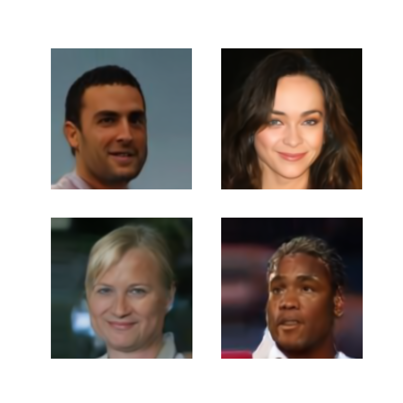
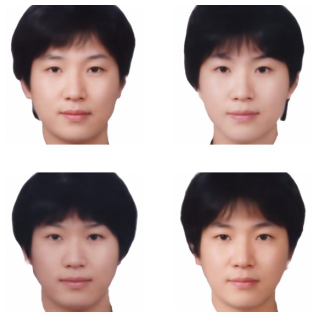
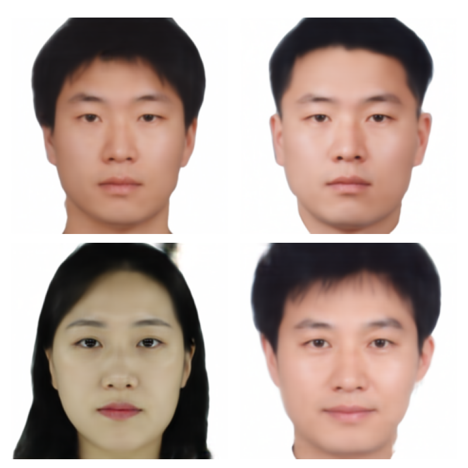

# Simple Latent Diffusion Model

🌐 README in Korean: [KR 한국어 버전](README_ko.md)

This repository provides a lightweight and modular implementation of a Latent Diffusion Model (LDM), which performs efficient image generation by operating in a lower-dimensional latent space instead of pixel space.

| **Dataset**                                     | **Generation Process of Latents**           | **Generated Data**                          |
|---------------------------------------------|-----------------------------------------|-----------------------------------------|
| Swiss-roll  |    |   |
| CIFAR-10  |    |   |
| CelebA  |    |   |

## **Text-to-image synthesis using CLIP-guided latent diffusion**

The table below showcases text-to-image generation using CLIP. The dataset used is the [Asian Composite Dataset](https://aihub.or.kr/aihubdata/data/view.do?currMenu=115&topMenu=100&aihubDataSe=data&dataSetSn=618), with input text in Korean.

| **English Text** | **Generated Image** |
|-----------------|------------------------------|
| A round face with voluminous, slightly long short hair, along with barely visible vocal cords, gives off a more feminine aura than a masculine one. The well-defined eyes and lips enhance the subject's delicate features, making them appear more refined and intellectual. |  |
| The hairstyle appears slightly unpolished, lacking a refined touch. The slightly upturned eyes give off a sharp and somewhat sensitive impression. Overall, they seem to have a slender physique and appear efficient in handling tasks, though their social interactions may not be particularly smooth. |  | 

## **Tutorials**

- [Tutorial for Latent Diffusion Model](notebook/simple_latent_diffusion_model_tutorial.ipynb)

## **Usage**

The following example demonstrates how to train a Latent Diffusion Model and generate data using the code in this repository. 

```python
import torch

from helper.painter import Painter
from helper.trainer import Trainer
from helper.data_generator import DataGenerator
from helper.loader import Loader
from helper.cond_encoder import CLIPEncoder

from auto_encoder.models.variational_auto_encoder import VariationalAutoEncoder
from clip.models.ko_clip import KoCLIPWrapper
from diffusion_model.sampler.ddim import DDIM
from diffusion_model.models.latent_diffusion_model import LatentDiffusionModel
from diffusion_model.network.unet import Unet
from diffusion_model.network.unet_wrapper import UnetWrapper

# Path to the configuration file
CONFIG_PATH = './configs/cifar10_config.yaml'

# Set device
device = torch.device('cuda' if torch.cuda.is_available() else 'cpu')

# Instantiate helper classes
painter = Painter()
loader = Loader()
data_generator = DataGenerator()

# Load CIFAR-10 dataset
data_loader = data_generator.cifar10(batch_size=128)

# Load CLIP model
clip = KoCLIPWrapper() # Any CLIP model from Hugging Face
cond_encoder = CLIPEncoder(clip, CONFIG_PATH) # Set encoder

# Train the Variational Autoencoder (VAE)
vae = VariationalAutoEncoder(CONFIG_PATH)  # Initialize the VAE model
trainer = Trainer(vae, vae.loss)  # Create a trainer for the VAE
trainer.train(dl=data_loader, epochs=100, file_name='vae', no_label=True)  # Train the VAE

# Train the Latent Diffusion Model (LDM)
sampler = DDIM(CONFIG_PATH)  # Initialize the DDIM sampler
network = UnetWrapper(Unet, CONFIG_PATH, cond_encoder)  # Initialize the U-Net network
ldm = LatentDiffusionModel(network, sampler, vae)  # Initialize the LDM
trainer = Trainer(ldm, ldm.loss)  # Create a trainer for the LDM
trainer.train(dl=data_loader, epochs=100, file_name='ldm', no_label=False)
# Train the LDM; set 'no_label=True' if the dataset does not include labels

# Load the trained models
vae = loader.model_load('models/vae', vae, is_ema=True)
ldm = loader.model_load('models/ldm', ldm, is_ema=True)

# Generate samples using the trained latent diffusion model
ldm.eval()
ldm = ldm.to(device)
sample = ldm(n_samples=4, y = '...', gamma = 3)  # Generate 4 sample images, 'y' represents any conditions, 'gamma' means guidance scale
painter.show_images(sample)  # Display the generated images
```


## **References**
- [lucidrains/denoising-diffusion-pytorch](https://github.com/lucidrains/denoising-diffusion-pytorch)
- [CompVis/latent-diffusion](https://github.com/CompVis/latent-diffusion)
- [labmlai/annotated_deep_learning_paper_implementations](https://github.com/labmlai/annotated_deep_learning_paper_implementations/tree/master/labml_nn/diffusion/stable_diffusion)
