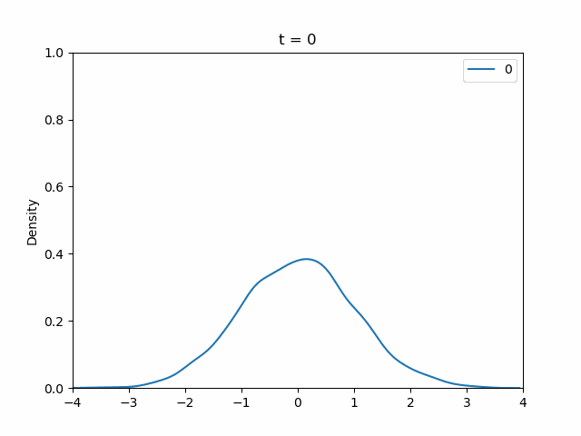
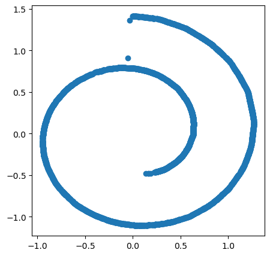

# Welcome to the Simple Latent Diffusion Model

🌐 README in Korean: [KR 한국어 버전](README_ko.md)

This repository contains a simplified implementation of a latent diffusion model. The code and contents will be updated continuously.
| Latent                                      | Image                                   |
|---------------------------------------------|-----------------------------------------|
|    |   |

## References
- [lucidrains/denoising-diffusion-pytorch](https://github.com/lucidrains/denoising-diffusion-pytorch)
- [CompVis/latent-diffusion](https://github.com/CompVis/latent-diffusion)
- [labmlai/annotated_deep_learning_paper_implementations](https://github.com/labmlai/annotated_deep_learning_paper_implementations/tree/master/labml_nn/diffusion/stable_diffusion)
